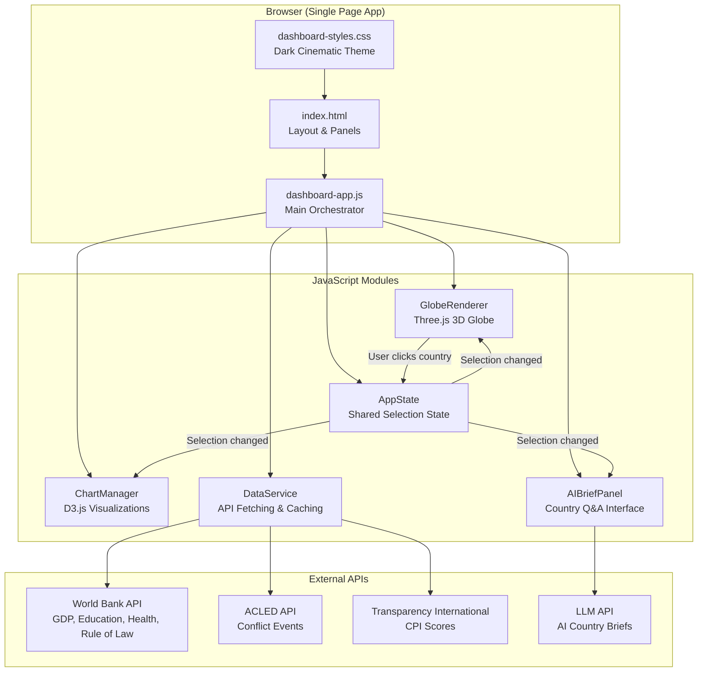
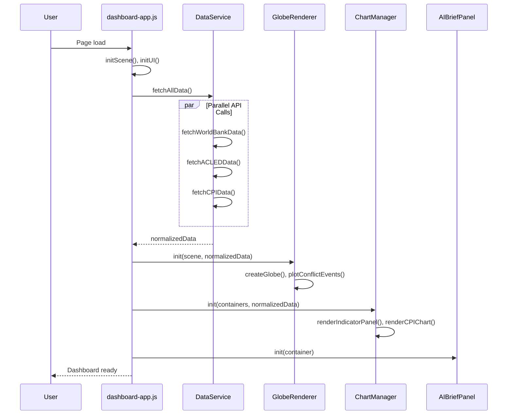
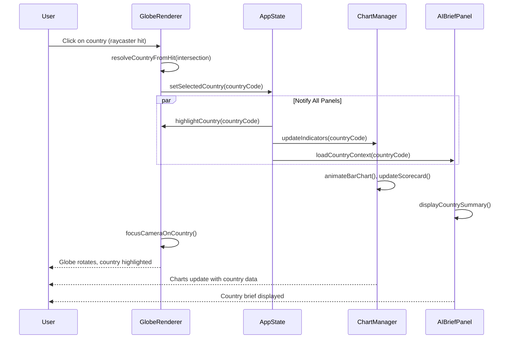
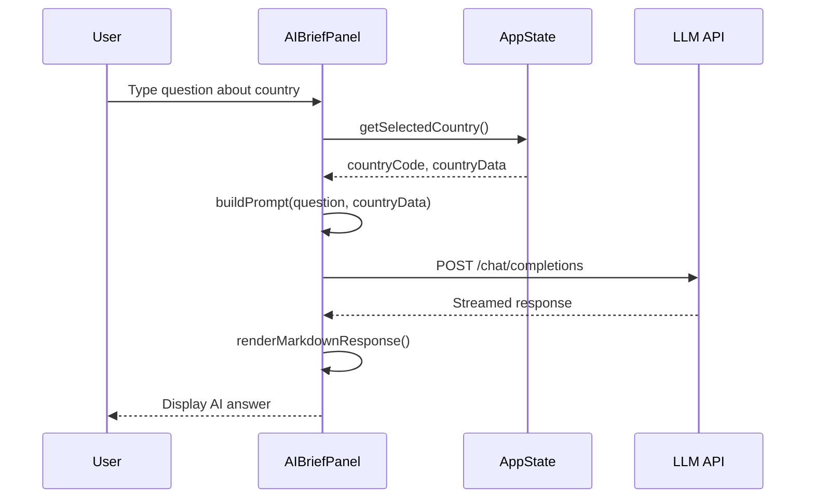

# Design Document: Geopolitical Analytics Dashboard

## Overview

The Geopolitical Analytics Dashboard is an interactive, browser-based intelligence tool that visualizes governance indicators, conflict events, and corruption data on a 3D globe and accompanying chart panels. It extends the existing Sophia Path workspace pattern (vanilla JavaScript, Three.js, dark cinematic UI) with D3.js-powered data visualizations and AI-driven country briefs.

The dashboard ingests data from three external APIs — World Bank (governance & development indicators), ACLED (Armed Conflict Location & Event Data), and Transparency International (Corruption Perceptions Index) — normalizes it into a unified country-keyed data store, and renders it across four coordinated views: a Three.js globe with conflict event plotting, a D3.js indicator panel, a CPI comparison chart, and an AI Q&A sidebar. All views respond to a shared selection state so clicking a country on the globe updates every panel simultaneously.

The system follows the existing workspace conventions: a single `index.html` entry point, a `dashboard-app.js` main module, and a `dashboard-styles.css` stylesheet, all housed in a `dashboard/` subfolder mirroring the `book/` pattern.

## Architecture



## Sequence Diagrams

### Application Startup



### Country Selection Flow



### AI Q&A Flow



## Components and Interfaces

### Component 1: AppState (Shared Selection State)

**Purpose**: Central event bus and state container that coordinates all panels. When a country is selected on the globe, AppState notifies charts, AI panel, and the globe itself to update.

```javascript
// AppState — Pub/Sub state manager
const AppState = {
  _state: {
    selectedCountry: null,    // ISO 3166-1 alpha-3 code, e.g. "USA"
    hoveredCountry: null,
    dataLoaded: false,
    activeDataset: 'governance', // 'governance' | 'conflict' | 'corruption'
    timeRange: { start: 2018, end: 2023 },
    countryData: {}            // Map<countryCode, NormalizedCountryData>
  },
  _listeners: new Map(),

  get(key) { /* returns _state[key] */ },
  set(key, value) { /* updates _state[key], notifies listeners */ },
  on(key, callback) { /* registers listener for key changes */ },
  off(key, callback) { /* removes listener */ },
  getCountryData(code) { /* returns countryData[code] or null */ }
};
```

**Responsibilities**:
- Hold the single source of truth for selected country, active dataset, and time range
- Notify registered listeners when state changes
- Provide accessor methods for country data lookup

### Component 2: DataService (API Fetching & Normalization)

**Purpose**: Fetches data from World Bank, ACLED, and Transparency International APIs, normalizes it into a unified country-keyed structure, and caches results in memory.

```javascript
// DataService — API layer with caching
const DataService = {
  _cache: new Map(),

  async fetchAllData() { /* orchestrates parallel fetches, returns normalized map */ },
  async fetchWorldBankData(indicators, dateRange) { /* World Bank API v2 */ },
  async fetchACLEDData(dateRange) { /* ACLED read API */ },
  async fetchCPIData(year) { /* Transparency International CPI dataset */ },
  normalizeToCountryMap(wbData, acledData, cpiData) { /* merges into unified structure */ },
  getCountryByCode(code) { /* lookup from cache */ },
  getConflictEvents(filters) { /* returns filtered ACLED events */ }
};
```

**Responsibilities**:
- Manage all external API communication
- Normalize heterogeneous API responses into a unified schema
- Cache fetched data to avoid redundant network calls
- Provide filtered access to conflict events for globe plotting

### Component 3: GlobeRenderer (Three.js 3D Globe)

**Purpose**: Renders an interactive 3D Earth globe using Three.js, plots conflict events as point markers, highlights selected countries, and handles camera rotation/zoom.

```javascript
// GlobeRenderer — Three.js globe with conflict event plotting
const GlobeRenderer = {
  scene: null,
  camera: null,
  renderer: null,
  controls: null,
  globeMesh: null,
  countryMeshes: new Map(),
  eventMarkers: [],
  raycaster: new THREE.Raycaster(),

  init(container, countryData) { /* sets up scene, globe, lighting, controls */ },
  createGlobe() { /* sphere geometry with earth texture */ },
  plotConflictEvents(events) { /* places markers at lat/lng positions */ },
  highlightCountry(countryCode) { /* visual highlight on selected country */ },
  clearHighlight() { /* removes current highlight */ },
  focusCameraOnCountry(countryCode) { /* smooth camera tween to country */ },
  latLngToVector3(lat, lng, radius) { /* coordinate conversion */ },
  onPointerClick(event) { /* raycaster country detection */ },
  animate() { /* render loop with controls update */ },
  dispose() { /* cleanup Three.js resources */ }
};
```

**Responsibilities**:
- Render a textured 3D globe with ambient and directional lighting
- Convert lat/lng coordinates to 3D positions for event markers
- Handle raycasting for country click detection
- Animate camera focus transitions when a country is selected
- Manage conflict event markers (add, remove, filter by type)

### Component 4: ChartManager (D3.js Visualizations)

**Purpose**: Renders D3.js charts for governance indicators, CPI scores, and development metrics. Updates dynamically when the selected country changes.

```javascript
// ChartManager — D3.js chart rendering
const ChartManager = {
  containers: {},
  charts: {},

  init(containerMap, countryData) { /* creates chart instances */ },
  renderIndicatorPanel(countryCode) { /* bar/radar chart of WB indicators */ },
  renderCPIChart(countryCode) { /* horizontal bar chart comparing CPI scores */ },
  renderTimeSeriesChart(countryCode, indicator) { /* line chart over time */ },
  renderConflictBreakdown(countryCode) { /* pie/donut chart of event types */ },
  updateAllCharts(countryCode) { /* refreshes all charts for new selection */ },
  animateTransition(chart, newData) { /* D3 transition for smooth updates */ },
  createTooltip(container) { /* reusable tooltip component */ },
  dispose() { /* cleanup D3 elements */ }
};
```

**Responsibilities**:
- Render bar charts for governance indicators (GDP, education, health, rule of law)
- Render CPI comparison charts with regional/global context
- Render time-series line charts for trend analysis
- Animate transitions when data changes
- Provide interactive tooltips on hover

### Component 5: AIBriefPanel (AI-Powered Country Q&A)

**Purpose**: Provides an AI chat interface where users can ask questions about a country's governance, economy, or development trends. Sends country context data alongside user questions to an LLM API.

```javascript
// AIBriefPanel — AI-powered country briefs
const AIBriefPanel = {
  container: null,
  chatHistory: [],
  currentCountry: null,

  init(container) { /* sets up chat UI, input handler */ },
  loadCountryContext(countryCode) { /* prepares context from DataService */ },
  async askQuestion(question) { /* sends question + context to LLM */ },
  buildPrompt(question, countryData) { /* constructs system + user prompt */ },
  renderResponse(text) { /* displays markdown-formatted response */ },
  clearChat() { /* resets chat history */ },
  displayCountrySummary(countryCode) { /* auto-generates brief on selection */ }
};
```

**Responsibilities**:
- Build context-rich prompts from country data for the LLM
- Stream and render AI responses in a chat-like interface
- Maintain conversation history per country session
- Auto-generate a country summary when a new country is selected

## Data Models

### NormalizedCountryData

```javascript
/**
 * @typedef {Object} NormalizedCountryData
 * @property {string} code          - ISO 3166-1 alpha-3 country code
 * @property {string} name          - Country display name
 * @property {number} lat           - Centroid latitude
 * @property {number} lng           - Centroid longitude
 * @property {GovernanceIndicators} governance
 * @property {ConflictData} conflict
 * @property {CorruptionData} corruption
 */
const NormalizedCountryData = {
  code: '',        // "USA", "GBR", "NGA"
  name: '',        // "United States", "United Kingdom"
  lat: 0,
  lng: 0,
  governance: {},
  conflict: {},
  corruption: {}
};
```

**Validation Rules**:
- `code` must be a valid ISO 3166-1 alpha-3 string (3 uppercase letters)
- `lat` must be in range [-90, 90]
- `lng` must be in range [-180, 180]
- At least one of `governance`, `conflict`, or `corruption` must contain data

### GovernanceIndicators

```javascript
/**
 * @typedef {Object} GovernanceIndicators
 * @property {number|null} gdpPerCapita       - GDP per capita (current USD)
 * @property {number|null} gdpGrowth          - GDP growth (annual %)
 * @property {number|null} educationExpend     - Education expenditure (% of GDP)
 * @property {number|null} literacyRate        - Adult literacy rate (%)
 * @property {number|null} lifeExpectancy      - Life expectancy at birth (years)
 * @property {number|null} healthExpend        - Health expenditure (% of GDP)
 * @property {number|null} ruleOfLaw           - Rule of Law index (-2.5 to 2.5)
 * @property {number|null} govEffectiveness    - Government Effectiveness (-2.5 to 2.5)
 * @property {Object<string, number[]>} timeSeries - indicator -> [values by year]
 */
const GovernanceIndicators = {
  gdpPerCapita: null,
  gdpGrowth: null,
  educationExpend: null,
  literacyRate: null,
  lifeExpectancy: null,
  healthExpend: null,
  ruleOfLaw: null,
  govEffectiveness: null,
  timeSeries: {}
};
```

**Validation Rules**:
- Numeric fields are nullable (data may be unavailable for some countries)
- `ruleOfLaw` and `govEffectiveness` range from -2.5 to 2.5 (World Bank WGI scale)
- `timeSeries` keys match World Bank indicator codes

### ConflictData

```javascript
/**
 * @typedef {Object} ConflictEvent
 * @property {string} eventId       - Unique ACLED event identifier
 * @property {string} eventType     - "Battles", "Violence against civilians", etc.
 * @property {string} date          - ISO date string
 * @property {number} lat           - Event latitude
 * @property {number} lng           - Event longitude
 * @property {number} fatalities    - Reported fatalities
 * @property {string} actor1        - Primary actor name
 * @property {string} actor2        - Secondary actor name (may be empty)
 * @property {string} notes         - Event description
 */

/**
 * @typedef {Object} ConflictData
 * @property {number} totalEvents       - Total conflict events in period
 * @property {number} totalFatalities   - Sum of fatalities
 * @property {ConflictEvent[]} events   - Array of individual events
 * @property {Object<string, number>} byType - Event count by type
 */
const ConflictData = {
  totalEvents: 0,
  totalFatalities: 0,
  events: [],
  byType: {}
};
```

**Validation Rules**:
- `fatalities` must be >= 0
- `eventType` must be one of ACLED's defined event types
- `lat`/`lng` must be valid geographic coordinates
- `events` array may be empty for countries with no recorded conflict

### CorruptionData

```javascript
/**
 * @typedef {Object} CorruptionData
 * @property {number|null} cpiScore     - CPI score (0-100, 100 = very clean)
 * @property {number|null} cpiRank      - Global rank
 * @property {number|null} regionAvg    - Regional average CPI
 * @property {number|null} globalAvg    - Global average CPI
 * @property {Object<number, number>} historical - year -> CPI score
 */
const CorruptionData = {
  cpiScore: null,
  cpiRank: null,
  regionAvg: null,
  globalAvg: null,
  historical: {}
};
```

**Validation Rules**:
- `cpiScore` ranges from 0 to 100
- `cpiRank` is a positive integer
- `historical` keys are 4-digit years


## Key Functions with Formal Specifications

### Function 1: latLngToVector3()

```javascript
function latLngToVector3(lat, lng, radius) {
  const phi = (90 - lat) * (Math.PI / 180);
  const theta = (lng + 180) * (Math.PI / 180);
  return new THREE.Vector3(
    -(radius * Math.sin(phi) * Math.cos(theta)),
    radius * Math.cos(phi),
    radius * Math.sin(phi) * Math.sin(theta)
  );
}
```

**Preconditions:**
- `lat` is a number in range [-90, 90]
- `lng` is a number in range [-180, 180]
- `radius` is a positive number

**Postconditions:**
- Returns a `THREE.Vector3` whose length equals `radius` (within floating-point tolerance)
- The vector lies on the surface of a sphere of the given radius
- (lat=0, lng=0) maps to a point on the sphere's equator at the prime meridian
- (lat=90, lng=any) maps to the north pole (0, radius, 0)

**Loop Invariants:** N/A (no loops)

### Function 2: normalizeToCountryMap()

```javascript
function normalizeToCountryMap(wbData, acledData, cpiData) {
  const countryMap = new Map();

  // Step 1: Seed from World Bank data (most comprehensive country list)
  for (const entry of wbData) {
    const code = entry.countryiso3code;
    if (!code || code.length !== 3) continue;
    countryMap.set(code, {
      code,
      name: entry.country.value,
      lat: COUNTRY_CENTROIDS[code]?.lat ?? 0,
      lng: COUNTRY_CENTROIDS[code]?.lng ?? 0,
      governance: extractGovernance(entry),
      conflict: { totalEvents: 0, totalFatalities: 0, events: [], byType: {} },
      corruption: { cpiScore: null, cpiRank: null, regionAvg: null, globalAvg: null, historical: {} }
    });
  }

  // Step 2: Merge ACLED conflict events
  for (const event of acledData) {
    const code = event.iso3;
    if (countryMap.has(code)) {
      const country = countryMap.get(code);
      country.conflict.events.push(normalizeACLEDEvent(event));
      country.conflict.totalEvents++;
      country.conflict.totalFatalities += event.fatalities || 0;
      country.conflict.byType[event.event_type] = (country.conflict.byType[event.event_type] || 0) + 1;
    }
  }

  // Step 3: Merge CPI scores
  for (const entry of cpiData) {
    const code = entry.iso3;
    if (countryMap.has(code)) {
      const country = countryMap.get(code);
      country.corruption.cpiScore = entry.score;
      country.corruption.cpiRank = entry.rank;
    }
  }

  return countryMap;
}
```

**Preconditions:**
- `wbData` is an array of World Bank API response objects with `countryiso3code` fields
- `acledData` is an array of ACLED event objects with `iso3`, `latitude`, `longitude` fields
- `cpiData` is an array of CPI objects with `iso3`, `score`, `rank` fields
- `COUNTRY_CENTROIDS` lookup table is available

**Postconditions:**
- Returns a `Map<string, NormalizedCountryData>` keyed by ISO alpha-3 codes
- Every entry has all three data sections (governance, conflict, corruption) initialized
- Conflict event counts match the actual number of events in the events array
- `totalFatalities` equals the sum of all individual event fatalities for that country
- No duplicate country entries exist

**Loop Invariants:**
- After processing each World Bank entry: `countryMap.size` increases by at most 1
- After processing each ACLED event: `country.conflict.totalEvents === country.conflict.events.length`
- After processing each CPI entry: CPI data is merged only into existing country entries

### Function 3: plotConflictEvents()

```javascript
function plotConflictEvents(events, globeRadius) {
  const markers = [];
  const geometry = new THREE.SphereGeometry(0.008, 8, 8);

  // Color scale by event type
  const colorMap = {
    'Battles': 0xff4444,
    'Violence against civilians': 0xff8800,
    'Explosions/Remote violence': 0xffcc00,
    'Protests': 0x44aaff,
    'Riots': 0xaa44ff,
    'Strategic developments': 0x44ff88
  };

  for (const event of events) {
    const color = colorMap[event.eventType] || 0xffffff;
    const material = new THREE.MeshBasicMaterial({
      color,
      transparent: true,
      opacity: 0.7
    });

    const marker = new THREE.Mesh(geometry, material);
    const position = latLngToVector3(event.lat, event.lng, globeRadius + 0.01);
    marker.position.copy(position);
    marker.userData = { eventId: event.eventId, countryCode: event.countryCode };

    markers.push(marker);
  }

  return markers;
}
```

**Preconditions:**
- `events` is an array of `ConflictEvent` objects with valid `lat`, `lng` fields
- `globeRadius` is a positive number matching the globe mesh radius
- Three.js is loaded and available

**Postconditions:**
- Returns an array of `THREE.Mesh` objects, one per event
- Each marker is positioned slightly above the globe surface (`globeRadius + 0.01`)
- Each marker's `userData` contains the event ID and country code for raycasting
- Marker count equals `events.length`
- All markers use the shared geometry instance (memory efficient)

**Loop Invariants:**
- `markers.length` equals the number of events processed so far
- Each marker position vector has length approximately `globeRadius + 0.01`

### Function 4: buildPrompt()

```javascript
function buildPrompt(question, countryData) {
  const { name, governance, conflict, corruption } = countryData;

  const systemPrompt = `You are a geopolitical analyst. Provide concise, data-driven answers about countries.
Use the provided data context. If data is unavailable, say so. Keep responses under 300 words.`;

  const contextBlock = `
Country: ${name} (${countryData.code})
GDP per capita: ${governance.gdpPerCapita ? '$' + governance.gdpPerCapita.toLocaleString() : 'N/A'}
GDP growth: ${governance.gdpGrowth ? governance.gdpGrowth.toFixed(1) + '%' : 'N/A'}
Life expectancy: ${governance.lifeExpectancy ? governance.lifeExpectancy.toFixed(1) + ' years' : 'N/A'}
Rule of Law index: ${governance.ruleOfLaw ?? 'N/A'}
Education expenditure: ${governance.educationExpend ? governance.educationExpend.toFixed(1) + '% of GDP' : 'N/A'}
CPI Score: ${corruption.cpiScore ?? 'N/A'}/100 (Rank: ${corruption.cpiRank ?? 'N/A'})
Conflict events (recent): ${conflict.totalEvents}
Conflict fatalities (recent): ${conflict.totalFatalities}
  `.trim();

  return {
    system: systemPrompt,
    user: `Context:\n${contextBlock}\n\nQuestion: ${question}`
  };
}
```

**Preconditions:**
- `question` is a non-empty string
- `countryData` is a valid `NormalizedCountryData` object
- `countryData.name` is a non-empty string

**Postconditions:**
- Returns an object with `system` and `user` string properties
- `system` prompt instructs the LLM to act as a geopolitical analyst
- `user` prompt contains the country data context followed by the user's question
- Null/undefined numeric values are rendered as "N/A" (never as "null" or "undefined")
- The prompt does not exceed reasonable token limits for the LLM

**Loop Invariants:** N/A (no loops)

## Algorithmic Pseudocode

### Main Initialization Algorithm

```javascript
// ALGORITHM: Dashboard Initialization
// INPUT: DOM container element
// OUTPUT: Fully initialized dashboard with data loaded

async function initDashboard(container) {
  // ASSERT: container is a valid DOM element
  // ASSERT: Three.js and D3.js are loaded

  // Step 1: Initialize shared state
  const state = AppState;
  state.set('dataLoaded', false);

  // Step 2: Show loading overlay
  showLoader('Fetching geopolitical data...');

  // Step 3: Fetch all data in parallel
  const [wbData, acledData, cpiData] = await Promise.all([
    DataService.fetchWorldBankData(INDICATOR_CODES, { start: 2018, end: 2023 }),
    DataService.fetchACLEDData({ start: '2022-01-01', end: '2023-12-31' }),
    DataService.fetchCPIData(2023)
  ]);

  // Step 4: Normalize into unified country map
  const countryMap = DataService.normalizeToCountryMap(wbData, acledData, cpiData);
  state.set('countryData', countryMap);
  state.set('dataLoaded', true);

  // Step 5: Initialize Three.js globe
  const globeContainer = container.querySelector('#globe-container');
  GlobeRenderer.init(globeContainer, countryMap);

  // Step 6: Plot conflict events on globe
  const allEvents = Array.from(countryMap.values())
    .flatMap(c => c.conflict.events);
  GlobeRenderer.plotConflictEvents(allEvents);

  // Step 7: Initialize D3.js charts
  const chartContainers = {
    indicators: container.querySelector('#indicators-panel'),
    cpi: container.querySelector('#cpi-panel'),
    timeSeries: container.querySelector('#timeseries-panel'),
    conflictBreakdown: container.querySelector('#conflict-panel')
  };
  ChartManager.init(chartContainers, countryMap);

  // Step 8: Initialize AI panel
  const aiContainer = container.querySelector('#ai-panel');
  AIBriefPanel.init(aiContainer);

  // Step 9: Wire up state listeners
  state.on('selectedCountry', (countryCode) => {
    GlobeRenderer.highlightCountry(countryCode);
    GlobeRenderer.focusCameraOnCountry(countryCode);
    ChartManager.updateAllCharts(countryCode);
    AIBriefPanel.loadCountryContext(countryCode);
  });

  // Step 10: Hide loader, start render loop
  hideLoader();
  GlobeRenderer.animate();

  // POSTCONDITION: All panels initialized, data loaded, state listeners wired
}
```

### Country Selection via Raycasting Algorithm

```javascript
// ALGORITHM: Country Detection from Globe Click
// INPUT: PointerEvent from user click
// OUTPUT: ISO alpha-3 country code or null

function resolveCountryFromClick(event, camera, globeMesh, countryMeshes) {
  // ASSERT: camera and globeMesh are valid Three.js objects
  // ASSERT: countryMeshes is a Map<countryCode, THREE.Mesh>

  // Step 1: Convert screen coordinates to normalized device coordinates
  const mouse = new THREE.Vector2();
  mouse.x = (event.clientX / window.innerWidth) * 2 - 1;
  mouse.y = -(event.clientY / window.innerHeight) * 2 + 1;

  // Step 2: Cast ray from camera through mouse position
  const raycaster = new THREE.Raycaster();
  raycaster.setFromCamera(mouse, camera);

  // Step 3: Test intersection with country meshes first (higher priority)
  const countryHits = raycaster.intersectObjects(
    Array.from(countryMeshes.values()), false
  );

  if (countryHits.length > 0) {
    const hitMesh = countryHits[0].object;
    // Find country code from mesh userData
    for (const [code, mesh] of countryMeshes) {
      if (mesh === hitMesh) return code;
    }
  }

  // Step 4: Fallback — intersect globe sphere, convert hit point to lat/lng
  const globeHits = raycaster.intersectObject(globeMesh, false);
  if (globeHits.length > 0) {
    const point = globeHits[0].point;
    const { lat, lng } = vector3ToLatLng(point);
    return findNearestCountry(lat, lng);
  }

  // Step 5: No intersection — click was in empty space
  return null;

  // POSTCONDITION: Returns valid country code if globe was clicked, null otherwise
}
```

### Data Fetching with Retry Algorithm

```javascript
// ALGORITHM: Resilient API Fetch with Exponential Backoff
// INPUT: URL string, options object
// OUTPUT: Parsed JSON response or throws after max retries

async function fetchWithRetry(url, options = {}, maxRetries = 3) {
  // ASSERT: url is a valid URL string
  // ASSERT: maxRetries >= 1

  let lastError = null;

  for (let attempt = 0; attempt < maxRetries; attempt++) {
    // LOOP INVARIANT: attempt < maxRetries, all previous attempts failed
    try {
      const response = await fetch(url, {
        ...options,
        signal: AbortSignal.timeout(15000) // 15s timeout
      });

      if (!response.ok) {
        throw new Error(`HTTP ${response.status}: ${response.statusText}`);
      }

      const data = await response.json();
      // POSTCONDITION: data is a valid parsed JSON object
      return data;

    } catch (error) {
      lastError = error;
      if (attempt < maxRetries - 1) {
        // Exponential backoff: 1s, 2s, 4s
        const delay = Math.pow(2, attempt) * 1000;
        await new Promise(resolve => setTimeout(resolve, delay));
      }
    }
  }

  // All retries exhausted
  throw new Error(`Failed after ${maxRetries} attempts: ${lastError.message}`);

  // POSTCONDITION: Either returns valid JSON or throws with descriptive error
}
```

## Example Usage

```javascript
// Example 1: Initialize the dashboard
document.addEventListener('DOMContentLoaded', async () => {
  const container = document.getElementById('dashboard');
  await initDashboard(container);
});

// Example 2: Programmatically select a country
AppState.set('selectedCountry', 'NGA'); // Select Nigeria

// Example 3: Get conflict events for a specific country
const nigeriaData = AppState.getCountryData('NGA');
console.log(`Nigeria has ${nigeriaData.conflict.totalEvents} conflict events`);
console.log(`CPI Score: ${nigeriaData.corruption.cpiScore}/100`);

// Example 4: Ask AI about a country
AIBriefPanel.loadCountryContext('NGA');
const response = await AIBriefPanel.askQuestion(
  'What are the main governance challenges facing Nigeria?'
);

// Example 5: Filter conflict events by type
const battles = DataService.getConflictEvents({
  countryCode: 'NGA',
  eventType: 'Battles',
  dateRange: { start: '2023-01-01', end: '2023-12-31' }
});
GlobeRenderer.plotConflictEvents(battles);

// Example 6: Convert coordinates for globe plotting
const lagosPosition = latLngToVector3(6.5244, 3.3792, 1.0);
// Returns THREE.Vector3 on globe surface at Lagos, Nigeria
```

## Correctness Properties

*A property is a characteristic or behavior that should hold true across all valid executions of a system — essentially, a formal statement about what the system should do. Properties serve as the bridge between human-readable specifications and machine-verifiable correctness guarantees.*

### Property 1: Coordinate Conversion Round-Trip

*For any* valid latitude in [-90, 90], longitude in [-180, 180], and positive radius, converting to a 3D vector via `latLngToVector3` and back via `vector3ToLatLng` shall produce latitude and longitude values within 0.001 degrees of the originals.

**Validates: Requirements 2.8**

### Property 2: Coordinate Conversion Preserves Radius

*For any* valid latitude in [-90, 90], longitude in [-180, 180], and positive radius, the 3D vector produced by `latLngToVector3` shall have a magnitude (length) equal to the specified radius within floating-point tolerance (ε < 1e-10).

**Validates: Requirements 2.7**

### Property 3: Normalization Data Completeness

*For any* combination of World Bank, ACLED, and CPI API response data (including cases where one or more sources return empty arrays), every entry in the resulting NormalizedCountryData map shall have all three data sections (governance, conflict, corruption) initialized as objects.

**Validates: Requirements 1.2, 1.3**

### Property 4: Conflict Data Consistency

*For any* set of ACLED conflict events fed into the normalization function, every country in the resulting map shall satisfy: `conflict.totalEvents === conflict.events.length` AND `conflict.totalFatalities === sum of fatalities across all events in conflict.events`.

**Validates: Requirements 1.4, 1.5**

### Property 5: Marker-Event Correspondence

*For any* array of ConflictEvent records passed to `plotConflictEvents`, the returned marker array shall have the same length as the input events array, and each marker shall be positioned at a distance of `globeRadius + 0.01` from the origin (within floating-point tolerance).

**Validates: Requirements 2.2, 2.3**

### Property 6: AppState Pub/Sub Correctness

*For any* sequence of `on(key, callback)` registrations and `set(key, value)` calls, every registered callback for that key shall be invoked with the new value. After calling `off(key, callback)`, that callback shall not be invoked on subsequent `set(key, value)` calls.

**Validates: Requirements 3.1, 3.3, 3.4**

### Property 7: AI Prompt Null Safety

*For any* NormalizedCountryData object where any numeric field (gdpPerCapita, gdpGrowth, lifeExpectancy, ruleOfLaw, educationExpend, cpiScore, cpiRank) is null or undefined, the prompt string produced by `buildPrompt` shall contain "N/A" for that field and shall never contain the literal strings "null" or "undefined".

**Validates: Requirements 5.3**

### Property 8: AI Prompt Context Inclusion

*For any* non-empty question string and valid NormalizedCountryData object, the prompt produced by `buildPrompt` shall contain the country name, the user's question text, and a system prompt instructing geopolitical analyst behavior.

**Validates: Requirements 5.2**

### Property 9: Data Validation Bounds

*For any* normalized country data, the following bounds shall hold: CPI scores are in [0, 100], ruleOfLaw and govEffectiveness are in [-2.5, 2.5], country codes are 3-character uppercase alphabetic strings, event latitudes are in [-90, 90], event longitudes are in [-180, 180], and event fatalities are >= 0.

**Validates: Requirements 6.1, 6.2, 6.3, 6.4, 6.5**

## Error Handling

### Error Scenario 1: API Fetch Failure

**Condition**: One or more external APIs (World Bank, ACLED, TI) return an error or timeout.
**Response**: The `fetchWithRetry` function retries up to 3 times with exponential backoff. If all retries fail, the dashboard loads with partial data — panels for the failed data source show a "Data unavailable" placeholder.
**Recovery**: A "Retry" button appears in the affected panel. The user can manually trigger a re-fetch for the failed data source without reloading the entire page.

### Error Scenario 2: Invalid Country Click (No Intersection)

**Condition**: User clicks on empty space (ocean, sky) rather than a country on the globe.
**Response**: `resolveCountryFromClick` returns `null`. No state change occurs. The current selection (if any) remains active.
**Recovery**: No recovery needed — this is normal user interaction.

### Error Scenario 3: LLM API Failure

**Condition**: The AI brief API call fails or returns an error.
**Response**: The AI panel displays a user-friendly error message: "Unable to generate brief. Please try again." The chat input remains active.
**Recovery**: User can re-submit their question. Previous successful responses in the chat history are preserved.

### Error Scenario 4: Missing Country Data

**Condition**: A country exists on the globe but has no data in any of the three data sources.
**Response**: Panels display "No data available for [Country Name]" with appropriate empty-state visuals. The globe still highlights the country.
**Recovery**: No recovery needed — this reflects genuine data gaps in the source APIs.

### Error Scenario 5: WebGL Not Supported

**Condition**: User's browser does not support WebGL (required for Three.js).
**Response**: A fallback message is displayed in the globe container: "3D globe requires WebGL. Please use a modern browser." Chart panels and AI panel still function normally.
**Recovery**: User switches to a WebGL-capable browser.

## Testing Strategy

### Unit Testing Approach

Key functions to unit test:
- `latLngToVector3` / `vector3ToLatLng` — coordinate conversion accuracy
- `normalizeToCountryMap` — data merging correctness with various input combinations
- `buildPrompt` — null handling, output format
- `fetchWithRetry` — retry behavior, timeout handling (mock fetch)
- `AppState` — listener registration, notification, state updates

### Property-Based Testing Approach

**Property Test Library**: fast-check

Properties to test:
- **Coordinate roundtrip**: `∀ lat ∈ [-90,90], lng ∈ [-180,180], r > 0: vector3ToLatLng(latLngToVector3(lat, lng, r)) ≈ (lat, lng)`
- **Normalization idempotency**: Normalizing the same raw data twice produces identical country maps
- **CPI bounds**: `∀ country ∈ normalizedData: country.corruption.cpiScore === null || (0 <= cpiScore <= 100)`
- **Event count consistency**: `∀ country: country.conflict.totalEvents === country.conflict.events.length`

### Integration Testing Approach

- End-to-end flow: Load dashboard → click country on globe → verify all panels update
- API integration: Verify real API responses can be normalized without errors
- Cross-panel coordination: Verify state changes propagate to all registered listeners

## Performance Considerations

- **Globe rendering**: Use instanced geometry for conflict markers to reduce draw calls. With thousands of ACLED events, individual meshes would be too expensive — `THREE.InstancedMesh` with a shared sphere geometry keeps the marker count scalable.
- **Data caching**: Cache API responses in `DataService._cache` keyed by request parameters. World Bank and CPI data changes infrequently (annually), so cache TTL can be 24 hours.
- **Chart transitions**: Use D3 transitions with `duration(300)` for smooth updates without blocking the main thread. Debounce rapid country selections (e.g., mouse dragging across globe) with a 150ms delay.
- **Lazy loading**: Load ACLED data progressively — fetch the most recent year first, then backfill historical data in the background.
- **Texture resolution**: Use a 2048x1024 earth texture for the globe. Higher resolutions provide diminishing returns on typical displays.

## Security Considerations

- **API keys**: ACLED requires an API key. Store it in a configuration object that can be swapped per environment. Never commit keys to source control.
- **LLM prompt injection**: Sanitize user questions before including them in the AI prompt. Strip any system-prompt-like instructions from user input.
- **CORS**: All three APIs support CORS for browser requests. If any API blocks direct browser access, route through a lightweight proxy.
- **Input validation**: Validate all API response data before rendering. Malformed coordinates or scores should be filtered out rather than crashing the visualization.
- **Content Security Policy**: The dashboard loads Three.js and D3.js from CDN. Ensure CSP headers allow these specific CDN origins.

## Dependencies

| Dependency | Version | Purpose |
|---|---|---|
| Three.js | r128+ | 3D globe rendering, raycasting, camera controls |
| D3.js | v7 | Chart rendering (bar, line, pie charts) |
| OrbitControls | (Three.js addon) | Globe rotation and zoom interaction |
| fast-check | latest | Property-based testing (dev dependency) |

**External APIs**:
- World Bank API v2 (`https://api.worldbank.org/v2/`) — No key required
- ACLED API (`https://api.acleddata.com/`) — Requires free API key
- Transparency International CPI — Public dataset (CSV/JSON download)
- LLM API — Configurable endpoint (OpenAI-compatible `/chat/completions`)
